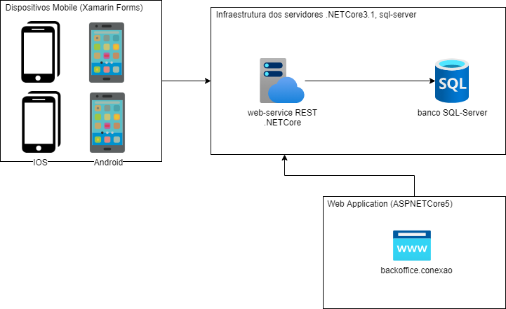

# Guadalupe.Conexão

### MISSÃO
Integrar e engajar a toda a comunidade da missão guadalupe por meio da tecnologia a todos os projetos da missão.

### PROPOSTA
entregar um feed de notícias interativo, atualizado dinamicamente com as informações atualizadas da missão, informando a toda a comunidade sempre as ultimas noticias por push de notificação, deixando assim a todos atualizados em tempo real e possibilitando a interação da comunidade com o tema apresentado.
Habitar um formulário para captar algumas informações da comunidade.

## Arquitetura

## Development server
Nesse primeiro momento iremos manter o APP e API no mesmo repositório/solução, para utilizar apenas um VS para codificação.

### Icones
Para gerar e manter os icónes está sendo utilizando o portal do: [Fontello](https://fontello.com/)

